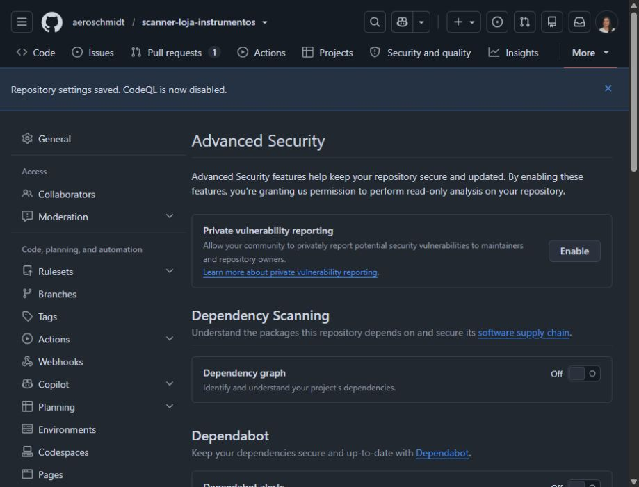
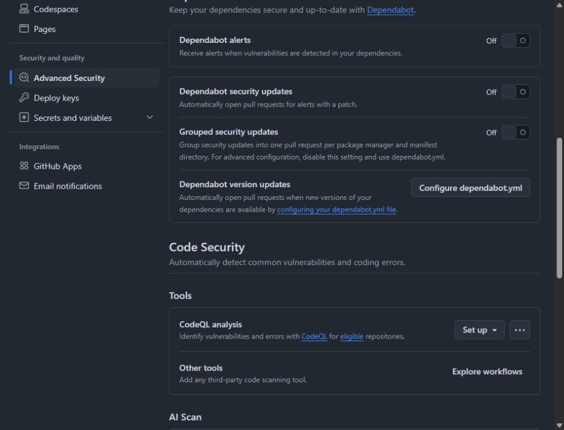
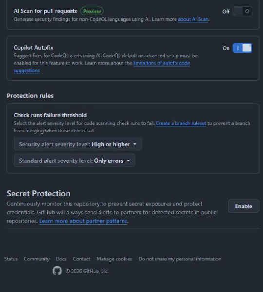
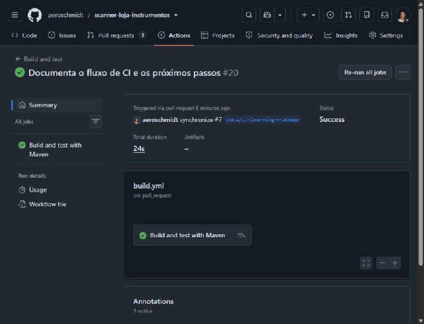
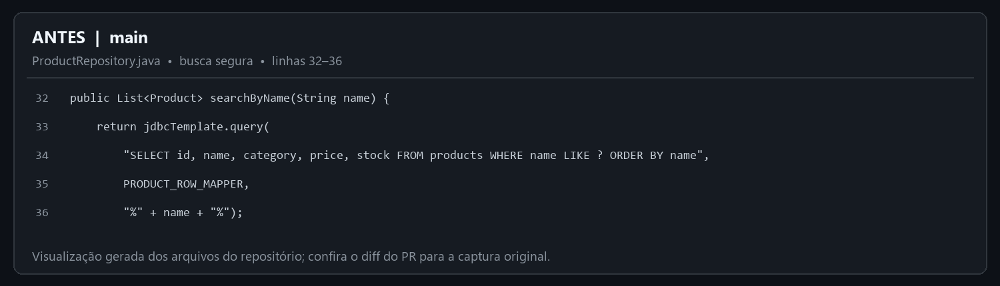
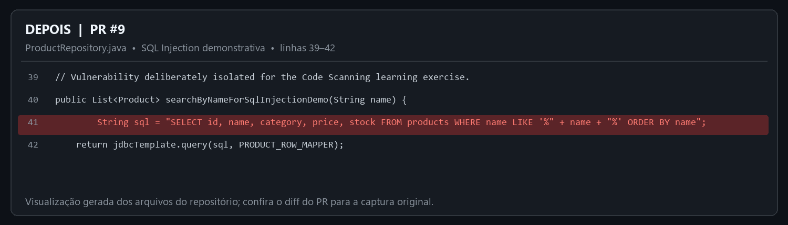

# Guia prático: GitHub Actions e segurança do repositório

**Projeto:** Som & Corda — loja de instrumentos  
**Repositório:** `aeroschmidt/scanner-loja-instrumentos`  
**Registro de estado:** 10 de outubro de 2026

Este guia registra o que está ativo, o que ainda está desligado e como cada participante acompanha os testes. A sequência será uma ferramenta por vez. Nenhuma ferramenta de GHAS é habilitada por este documento.

## 1. Estado atual do projeto

| Recurso | Estado observado | O que significa agora |
|---|---|---|
| GitHub Actions | Ativo | O workflow `Build and test` executa Maven `verify` em `push` para `main` e em PR destinado a `main`. |
| Sonar no workflow | Removido nesta etapa | O workflow não chama Sonar nem lê `SONAR_TOKEN`. A análise local continua descrita no README. |
| Dependency graph | Off | Ainda não há inventário de dependências apresentado nesta tela do repositório. |
| Dependabot alerts / security updates | Off | Ainda não serão gerados alertas/PRs do Dependabot neste repositório. |
| Dependabot version updates | Não configurado | Não há `.github/dependabot.yml`. |
| CodeQL / Code Scanning | Off | Settings oferece `Set up`; não está escaneando o código. |
| Secret Protection | Off | Settings oferece `Enable`. Em repositório público, padrões de parceiros podem continuar sendo reportados aos provedores, conforme a regra do GitHub. |
| Copilot Autofix | On na tela | Depende de CodeQL habilitado para propor correções de alertas CodeQL; não foi alterado. |

**Captura 1 — Settings > Advanced Security:** Dependency graph desligado.

**Captura 2 — Dependabot e CodeQL:** opções de atualização do Dependabot desligadas e CodeQL aguardando `Set up`.

**Captura 3 — Secret Protection:** botão `Enable` disponível, sem habilitação feita.

**Captura 4 — Actions:** execução de `Build and test` no PR #7 com resultado `Success`.

## 2. Para quem administra o repositório

### A. Entender o GitHub Actions que já existe

1. Abra o repositório e selecione **Actions** (a execução bem-sucedida está na Captura 4).
2. Abra uma execução do workflow **Build and test**.
3. Confira o evento que iniciou a execução (`push` ou `pull_request`), o job e seus steps.
4. Abra o job **Build and test with Maven** e expanda os steps para acompanhar cada etapa; o comando Maven executado é `./mvnw --batch-mode --no-transfer-progress verify`.
5. Em `build.yml`, identifique os gatilhos, o runner, a preparação do Java, o cache Maven e o comando de build. A execução recente registrada concluiu com sucesso.

O Actions coordena o workflow; Maven compila o projeto e roda os testes. Um check de Actions não significa que CodeQL, Dependabot ou Secret Scanning estejam ativos.

### B. Dependabot — testar primeiro

Dependabot cobre dois comportamentos distintos:

- **Dependabot alerts:** avisa que uma dependência usada tem vulnerabilidade conhecida.
- **Security updates:** pode abrir PR para atualizar dependência vulnerável quando há correção compatível.
- **Version updates:** procura novas versões mesmo sem alerta de vulnerabilidade; depende de `.github/dependabot.yml`.

Fluxo de administração, quando a proprietária decidir iniciar este teste:

1. Abra **Settings > Advanced Security**.
2. Ative **Dependency graph** e, separadamente, **Dependabot alerts**. Registre quais alertas aparecem.
3. Em uma etapa posterior, ative **Dependabot security updates** e observe se ele cria um PR de correção. Alertas e atualizações são opções diferentes.
4. Teste **version updates** somente quando decidir adicionar `.github/dependabot.yml`; selecione ecossistema Maven, diretório `/` e agenda apropriada.
5. Compare o PR automático com o PR comum: versão alterada, motivo, checks, logs e resultado de merge. O administrador não deve habilitar as etapas seguintes sem decidir que esta observação terminou.

### C. Code Scanning com CodeQL — etapa separada

1. Abra **Settings > Advanced Security > Code Security > CodeQL analysis > Set up**.
2. Prefira **Default setup** para este teste inicial. Revise as linguagens que o GitHub detectou e a configuração proposta.
3. Confirme **Enable CodeQL** somente quando este teste for autorizado.
4. Aguarde a primeira análise e consulte **Security > Code scanning**.
5. Em um PR de teste autorizado, confira alertas, arquivo/linha, explicação, severidade e o check de Code Scanning.
6. Registre que falhar um check só bloqueia merge quando as regras de proteção da branch exigirem esse check.

Default setup é uma configuração do Code Scanning gerenciada pelo GitHub. Não é necessário acrescentar manualmente uma segunda workflow de CodeQL para esse caminho.

### D. Secret Scanning — etapa separada

1. Abra **Settings > Advanced Security > Secret Protection > Enable**.
2. Leia a confirmação apresentada pelo GitHub e confira quais recursos estão incluídos para este repositório e plano.
3. Depois de ativar Secret Protection, examine separadamente **Push protection** e só a ative quando essa for a etapa autorizada.
4. Registre a diferença: Secret Scanning procura padrões de credenciais já presentes; Push protection pode bloquear um push que contenha um padrão reconhecido.
5. Não use credenciais reais em testes. Se for necessário validar detecção, use o procedimento e os valores de teste indicados pela documentação oficial do GitHub.

Regras e disponibilidade de funcionalidades dependem de visibilidade e plano do repositório. Em repositórios públicos, o GitHub informa que envia alertas de padrões de parceiros aos provedores correspondentes; isso não deve ser confundido com a configuração dos alertas privados para a proprietária.

### E. Depois dos testes: Sonar por último

Quando Dependabot, CodeQL e Secret Scanning tiverem sido testados e registrados, a última etapa será reintroduzir Sonar no workflow. Então poderemos comparar checks nativos do GitHub com a análise e o Quality Gate do Sonar. Até lá, o workflow não usa `SONAR_TOKEN`.

## 3. Para quem cria ou revisa PRs

### PR comum com Actions

1. Crie uma branch e faça commits assinados conforme a configuração do repositório.
2. Abra um PR para `main` e explique a mudança.
3. Em **Checks**, aguarde **Build and test / Build and test with Maven**.
4. Se falhar, abra o job, expanda o step vermelho e use o log para localizar o erro de compilação/teste.
5. Aguarde a revisão e aprovação da proprietária. O assistente não aprova nem faz merge de PRs.

### PR quando Code Scanning estiver habilitado

1. Consulte o check de Code Scanning no PR junto com o build Maven.
2. Abra cada alerta para ver a regra, severidade, arquivo e linha indicados.
3. Corrija no código e envie um novo commit; confirme se a nova análise atualizou ou fechou o alerta.
4. Trate os checks como sinais para revisão. O bloqueio de merge depende da regra de branch configurada pela administração.

### PR automático do Dependabot

1. Confira no diff quais dependências e versões foram alteradas.
2. Leia a descrição do alerta/atualização e examine os checks do PR.
3. Revise compatibilidade e testes como em qualquer PR. Um PR do bot não deve ser aprovado automaticamente neste exercício.
4. Somente a proprietária aprova e faz merge.

### Push protection

Se um push for bloqueado por uma possível credencial, não contorne o bloqueio com um segredo real. Remova o valor do código/histórico conforme o caso, use um armazenamento seguro para credenciais e siga o procedimento da organização.

## 4. Sequência e registro de aprendizado

1. Aprender o workflow de Actions já ativo.
2. Testar Dependabot isoladamente.
3. Testar Code Scanning/CodeQL isoladamente.
4. Testar Secret Scanning e, se autorizado, Push protection.
5. Consolidar capturas, o que apareceu nos PRs e o que cada papel deve fazer.
6. Reintegrar Sonar por último e comparar os resultados.

Cada ativação é uma decisão separada da proprietária. Registre para cada sessão: data, configuração alterada, estado anterior/novo, URL da execução ou PR, resultado observado e captura da tela.

## 5. Documentação oficial

- [Configurar Dependabot alerts](https://docs.github.com/en/code-security/how-tos/secure-your-supply-chain/secure-your-dependencies/configure-dependabot-alerts)
- [Configurar atualizações de versão do Dependabot](https://docs.github.com/en/code-security/how-tos/secure-your-supply-chain/secure-your-dependencies/configure-version-updates)
- [Configurar Code Scanning default setup](https://docs.github.com/en/code-security/how-tos/find-and-fix-code-vulnerabilities/configure-code-scanning/configure-code-scanning)
- [Tipos de configuração do Code Scanning](https://docs.github.com/en/code-security/concepts/code-scanning/setup-types)
- [Habilitar Secret Scanning](https://docs.github.com/en/code-security/how-tos/secure-your-secrets/detect-secret-leaks/enable-secret-scanning)
- [Habilitar Push protection](https://docs.github.com/en/code-security/how-tos/secure-your-secrets/prevent-future-leaks/enable-push-protection)
- [Quickstart de segurança do GitHub](https://docs.github.com/en/code-security/getting-started/quickstart-for-securing-your-repository)

## 6. Histórico desta trilha

- O PR #7 remove a execução do Sonar do workflow e mantém Maven `verify`.
- O workflow usa os eventos `push` para `main` e `pull_request` para `main`.
- Após a atualização deste guia, a execução [#21 do Actions](https://github.com/aeroschmidt/scanner-loja-instrumentos/actions/runs/38094010130) passou em 27 segundos no evento `pull_request`.
- As ferramentas de GHAS continuam desligadas conforme o escopo acordado.
- A proprietária revisa e aprova PRs. O assistente não aprova nem mescla.

## 7. Demonstração: PR #9 com Code Scanning desligado

**PR:** [Demonstração controlada de SQL Injection](https://github.com/aeroschmidt/scanner-loja-instrumentos/pull/9)
**Branch:** `demo/vulnerabilidade-sql-sem-code-scanning`
**Commit:** `32da6b1` — mensagem assinada e verificada pelo GitHub.

Este PR foi criado para comparar a compilação do Actions com a análise de segurança do CodeQL. Ele adiciona uma rota isolada de demonstração que monta uma consulta SQL concatenando a entrada `name`. A rota comum de busca continua usando consulta parametrizada. O código vulnerável existe apenas para o exercício e não deve ser mesclado nem usado em produção.

### Resultado observado

- O workflow **Build and test with Maven** concluiu com sucesso no PR. Isso confirma que o projeto compilou e que os testes executados por Maven passaram; não confirma que o código é seguro.
- O CodeQL / Code Scanning permaneceu desligado, conforme solicitado. Por isso, o GitHub não executou a análise CodeQL e não mostrou alerta de vulnerabilidade nesse PR.
- A ausência do alerta é esperada porque o analisador estava desligado. Não é evidência de que o código vulnerável tenha passado por uma análise estática.
- Não há reviewer atribuído: a revisão está pendente da mantenedora. Dependabot não é revisor humano; quando habilitado, pode abrir PRs de dependências, que ainda precisam de revisão.
- A mantenedora decide se aprova e mescla. O assistente não aprova nem mescla PRs.

**Evidências no GitHub:** [conversa e descrição do PR #9](https://github.com/aeroschmidt/scanner-loja-instrumentos/pull/9), [checks do PR #9](https://github.com/aeroschmidt/scanner-loja-instrumentos/pull/9/checks) e [execução do Actions #25](https://github.com/aeroschmidt/scanner-loja-instrumentos/actions/runs/38097282398). A Captura 4 é uma execução anterior do workflow, no PR #7; use os links do PR #9 para ver o resultado desta demonstração.

### Antes e depois: trecho que Code Scanning deve examinar

As duas figuras abaixo são visualizações legíveis dos trechos reais de `ProductRepository.java`, comparando `main` com o código introduzido no PR #9. Elas não são capturas da interface do GitHub. O diff original e as linhas verificáveis estão em [Files changed no PR #9](https://github.com/aeroschmidt/scanner-loja-instrumentos/pull/9/files).

**Antes — `main`, linhas 32–36: busca parametrizada.** O `?` ocupa o lugar do valor; `name` é passado separadamente como parâmetro. Isso evita montar SQL com o conteúdo recebido.

**Depois — PR #9, linhas 39–42: SQL Injection demonstrativa.** A entrada externa chega pelo parâmetro `name` em `ProductController.java`, linha 38. `ProductRepository.java`, linha 41, concatena esse valor dentro da instrução SQL; a linha 42 envia a consulta montada para `JdbcTemplate.query`. A rota de demonstração é `/api/products/demo/sql-injection` (linhas 37–40 do controller).

**O que esperamos observar quando Code Scanning for ligado:** se o CodeQL reconhecer o fluxo da entrada `name` até a consulta SQL, deverá registrar um alerta de SQL Injection associado ao trecho vulnerável, com arquivo, linha e explicação. O PR atual não confirma essa detecção: CodeQL está desligado. O resultado verde existente é somente do Maven; a compilação não detecta essa falha de segurança.

**“A análise encontrou” e “o PR bloqueou” são resultados diferentes.** Um alerta/anotação ajuda a localizar o problema no diff. Para impedir merge, a administração também precisa exigir o check de Code Scanning nas regras de proteção da branch. Com CodeQL desligado, nem alerta nem check do CodeQL são esperados neste PR. Consulte [alertas de Code Scanning](https://docs.github.com/en/code-security/concepts/code-scanning/code-scanning-alerts), [alertas em pull requests](https://docs.github.com/en/code-security/how-tos/manage-security-alerts/manage-code-scanning-alerts/triage-alerts-in-pull-requests) e [checks obrigatórios](https://docs.github.com/en/pull-requests/reference/status-checks).

**Versão segura de referência:** mantenha a consulta parametrizada, como em `searchByName` nas linhas 32–36. Ao encerrar a demonstração, remova a rota e o método inseguros; não copie esse trecho para uma aplicação real.

### Como ler este PR

1. Na conversa, leia **Objetivo**, **Alteração**, **O que observar** e **Revisão** antes de olhar os checks.
2. Em **Checks**, confirme que o job do Maven terminou com sucesso. Um check verde quer dizer que aquele job passou, dentro do que ele executa.
3. Compare a lista de checks com o que está habilitado em **Settings > Advanced Security**. Como CodeQL está desligado, não espere check nem alerta Code Scanning.
4. Em **Files changed**, localize `ProductRepository.java` nas linhas 39–42 e compare com a busca segura nas linhas 32–36. A visualização lado a lado acima resume essa alteração.
5. Não aprove nem mescle este PR enquanto a rota vulnerável estiver presente. A mantenedora deve decidir o próximo passo do exercício.

**Nota sobre a branch:** o nome atual identifica que este é um exercício isolado e que Code Scanning está desligado. Mantivemos a branch para preservar o PR #9 aberto e seus checks; a tentativa de renomeá-la pelo GitHub avisou que fecharia o PR.
