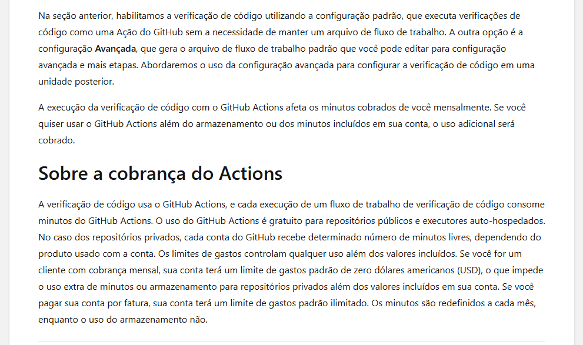

# Guia prático: GitHub Actions e segurança do repositório

**Projeto:** Som & Corda — loja de instrumentos  
**Repositório:** `aeroschmidt/scanner-loja-instrumentos`  
**Registro de estado:** 10 de outubro de 2026

Este guia registra o que está ativo, o que ainda está desligado e como a mantenedora acompanha os testes. As ferramentas são habilitadas uma por vez.

## 1. Estado atual do projeto

| Recurso | Estado observado | O que significa agora |
|---|---|---|
| GitHub Actions | Ativo | O workflow `Build and test` executa Maven `verify` em `push` para `main` e em PR destinado a `main`. |
| Dependency graph | Off | Ainda não há inventário de dependências apresentado nesta tela do repositório. |
| Dependabot alerts / security updates | Off | Ainda não serão gerados alertas/PRs do Dependabot neste repositório. |
| Dependabot version updates | Não configurado | Não há `.github/dependabot.yml`. |
| CodeQL / Code Scanning | Advanced setup ativo | `.github/workflows/codeql.yml` analisa `main` em push/PR e executa uma varredura diária ao meio-dia de Brasília. |
| Secret Protection | Off | Settings oferece `Enable`. Em repositório público, padrões de parceiros podem continuar sendo reportados aos provedores, conforme a regra do GitHub. |
| Copilot Autofix | On na tela | Depende de CodeQL habilitado para propor correções de alertas CodeQL; não foi alterado. |

As Capturas 1–4 registram o estado anterior à ativação do CodeQL. A Captura 2, em particular, mostra CodeQL ainda aguardando configuração; use a seção C abaixo para o estado atual.

**Captura 1 — Settings > Advanced Security:** Dependency graph desligado.

**Captura 2 — estado histórico antes do CodeQL:** Dependabot desligado e CodeQL ainda aguardando `Set up`. Esta captura antecede a configuração Advanced descrita abaixo.

**Captura 3 — Secret Protection:** botão `Enable` disponível, sem habilitação feita.

**Captura 4 — Actions:** execução de `Build and test` no PR #7 com resultado `Success`.

## 2. Para quem administra o repositório

### A. Entender o GitHub Actions que já existe

1. Abra o repositório e selecione **Actions** (a execução bem-sucedida está na Captura 4).
2. Abra uma execução do workflow **Build and test**.
3. Confira o evento que iniciou a execução (`push` ou `pull_request`), o job e seus steps.
4. Confira os steps de compilação e teste; o workflow executa `./mvnw --batch-mode --no-transfer-progress verify`.
5. Em `build.yml`, identifique os gatilhos, o runner, a preparação do Java, o cache Maven e o comando de build. A execução recente registrada concluiu com sucesso.

O Actions coordena os workflows; Maven compila o projeto e roda os testes. O workflow Maven e o workflow CodeQL são checks independentes.

### B. Dependabot — testar primeiro

Dependabot cobre dois comportamentos distintos:

- **Dependabot alerts:** avisa que uma dependência usada tem vulnerabilidade conhecida.
- **Security updates:** pode abrir PR para atualizar dependência vulnerável quando há correção compatível.
- **Version updates:** procura novas versões mesmo sem alerta de vulnerabilidade; depende de `.github/dependabot.yml`.

Fluxo de administração, quando a proprietária decidir iniciar este teste:

1. Abra **Settings > Advanced Security**.
2. Ative **Dependency graph** e, separadamente, **Dependabot alerts**. Registre quais alertas aparecem.
3. Em uma etapa posterior, ative **Dependabot security updates** e observe se ele cria um PR de correção. Alertas e atualizações são opções diferentes.
4. Teste **version updates** somente quando decidir adicionar `.github/dependabot.yml`; selecione ecossistema Maven, diretório `/` e agenda apropriada.
5. Compare o PR automático com o PR comum: versão alterada, motivo, checks, logs e resultado de merge. O administrador não deve habilitar as etapas seguintes sem decidir que esta observação terminou.

### C. Code Scanning com CodeQL — Advanced setup ativo

O workflow editável `.github/workflows/codeql.yml` foi criado pelo assistente **Advanced setup** do GitHub. O **Default setup** é administrado pela interface; Advanced setup deixa a configuração em YAML para controlar linguagens, matriz, build e eventos. A imagem do material didático compara esses dois modos; ela não é uma tela específica deste repositório.

O workflow analisa pushes para `main`, PRs destinados a `main` e executa uma varredura agendada todos os dias ao meio-dia no horário de Brasília (`cron: '0 12 * * *'`, fuso `America/Sao_Paulo`). O evento `schedule` executa a versão que está na branch padrão. Portanto, o novo horário passa a valer quando esta alteração chegar à `main`. A análise diária publica resultados; não cria nem mescla commits. O GitHub pode atrasar uma execução agendada durante períodos de alta demanda. Não há gatilho `workflow_dispatch`, então o botão **Run workflow** não está configurado.

Para administrar: revise o YAML em `.github/workflows/codeql.yml`, acompanhe **Actions > CodeQL Advanced** e depois **Security > Code scanning**. A matriz atual analisa GitHub Actions, Java e JavaScript/TypeScript; a aplicação está em Java. Em um PR de demonstração, o job CodeQL terminou, mas o resultado agregado Code Scanning apontou uma injeção SQL de severidade alta na linha do repositório indicada pelo alerta. Um check vermelho não bloqueia merge automaticamente; isso depende das regras de proteção da branch.

### D. Secret Scanning — etapa separada

1. Abra **Settings > Advanced Security > Secret Protection > Enable**.
2. Leia a confirmação apresentada pelo GitHub e confira quais recursos estão incluídos para este repositório e plano.
3. Depois de ativar Secret Protection, examine separadamente **Push protection** e só a ative quando essa for a etapa autorizada.
4. Registre a diferença: Secret Scanning procura padrões de credenciais já presentes; Push protection pode bloquear um push que contenha um padrão reconhecido.
5. Não use credenciais reais em testes. Se for necessário validar detecção, use o procedimento e os valores de teste indicados pela documentação oficial do GitHub.

Regras e disponibilidade de funcionalidades dependem de visibilidade e plano do repositório. Em repositórios públicos, o GitHub informa que envia alertas de padrões de parceiros aos provedores correspondentes; isso não deve ser confundido com a configuração dos alertas privados para a proprietária.

## 3. Para quem cria ou revisa PRs

### PR comum com Actions

1. Crie uma branch e faça commits assinados conforme a configuração do repositório.
2. Abra um PR para `main` e explique a mudança.
3. Em **Checks**, aguarde **Build and test / Build and test with Maven**.
4. Se falhar, abra o job, expanda o step vermelho e use o log para localizar o erro de compilação/teste.
5. Aguarde a revisão e aprovação da proprietária. O assistente não aprova nem faz merge de PRs.

### PR quando Code Scanning estiver habilitado

1. Consulte o check de Code Scanning no PR junto com o build Maven.
2. Abra cada alerta para ver a regra, severidade, arquivo e linha indicados.
3. Corrija no código e envie um novo commit; confirme se a nova análise atualizou ou fechou o alerta.
4. Trate os checks como sinais para revisão. O bloqueio de merge depende da regra de branch configurada pela administração.

### PR automático do Dependabot

1. Confira no diff quais dependências e versões foram alteradas.
2. Leia a descrição do alerta/atualização e examine os checks do PR.
3. Revise compatibilidade e testes como em qualquer PR. Um PR do bot não deve ser aprovado automaticamente neste exercício.
4. Somente a proprietária aprova e faz merge.

### Push protection

Se um push for bloqueado por uma possível credencial, não contorne o bloqueio com um segredo real. Remova o valor do código/histórico conforme o caso, use um armazenamento seguro para credenciais e siga o procedimento da organização.

## 4. Sequência e registro de aprendizado

1. Acompanhar o workflow Maven e o CodeQL Advanced separadamente.
2. Observar a análise agendada diária do CodeQL.
3. Testar Dependabot isoladamente.
4. Testar Secret Scanning e, se autorizado, Push protection.
5. Consolidar capturas, o que apareceu nos PRs e o que cada papel deve fazer.

Cada ativação é uma decisão separada da proprietária. Registre para cada sessão: data, configuração alterada, estado anterior/novo, URL da execução ou PR, resultado observado e captura da tela.

## 5. Documentação oficial

- [Configurar Dependabot alerts](https://docs.github.com/en/code-security/how-tos/secure-your-supply-chain/secure-your-dependencies/configure-dependabot-alerts)
- [Configurar atualizações de versão do Dependabot](https://docs.github.com/en/code-security/how-tos/secure-your-supply-chain/secure-your-dependencies/configure-version-updates)
- [Configurar Code Scanning Advanced setup](https://docs.github.com/en/code-security/how-tos/find-and-fix-code-vulnerabilities/configure-code-scanning/configuring-advanced-setup-for-code-scanning)
- [Tipos de configuração do Code Scanning](https://docs.github.com/en/code-security/concepts/code-scanning/setup-types)
- [Habilitar Secret Scanning](https://docs.github.com/en/code-security/how-tos/secure-your-secrets/detect-secret-leaks/enable-secret-scanning)
- [Habilitar Push protection](https://docs.github.com/en/code-security/how-tos/secure-your-secrets/prevent-future-leaks/enable-push-protection)
- [Quickstart de segurança do GitHub](https://docs.github.com/en/code-security/getting-started/quickstart-for-securing-your-repository)

## 6. Histórico desta trilha

- CodeQL foi habilitado por Advanced setup em `.github/workflows/codeql.yml`; a execução inicial está em [CodeQL Advanced #1](https://github.com/aeroschmidt/scanner-loja-instrumentos/actions/runs/38104871050) e a execução mais recente em [CodeQL Advanced #3](https://github.com/aeroschmidt/scanner-loja-instrumentos/actions/runs/38105323924).
- A análise de PR executou os jobs de Actions, Java e JavaScript/TypeScript. O resultado agregado de Code Scanning aponta a vulnerabilidade de demonstração; consulte o [check do PR #10](https://github.com/aeroschmidt/scanner-loja-instrumentos/pull/10/checks?check_run_id=114369610380).
- O cron neste documento foi ajustado para análise diária ao meio-dia de Brasília. A mudança precisa estar na branch padrão para que o evento `schedule` use o novo horário.
- Dependabot e Secret Protection permanecem desligados; cada recurso será avaliado em uma etapa separada.
- A mantenedora revisa e aprova PRs, salvo autorização explícita e específica para uma ação diferente.
