# Guia do usuário para Pull Requests e verificações de segurança

Este guia explica como autores e revisores de código acompanham um Pull Request (PR) no GitHub quando há verificações automáticas. Ele ajuda a interpretar resultados do GitHub Actions e do GitHub Advanced Security (GHAS), responder a alertas e decidir o que precisa de revisão humana. O administrador do repositório configura as ferramentas; as instruções de configuração ficam no [guia da mantenedora](guia-maintainer-ghas.md).

Um check verde significa que aquela verificação terminou com sucesso. Isso não prova, por si só, que o código está livre de defeitos ou seguro. Alertas de segurança e bloqueios de merge também são coisas diferentes: o alerta aponta um achado; a regra de proteção da branch define se o merge fica impedido até a resolução.

## 1. Quem faz o quê

- **Autor do PR:** descreve a mudança, acompanha os checks, corrige falhas e responde às observações da revisão.
- **Revisor:** entende o objetivo e o diff, verifica os resultados automáticos e pede ajustes quando necessário.
- **Administrador do repositório:** habilita e configura workflows, ferramentas de segurança e regras de proteção. Consulte o guia da mantenedora para essas tarefas.
- **Bots:** podem executar análises ou propor atualizações. Um resultado automático não substitui a revisão e aprovação previstas pelo processo da equipe.

## 2. Fluxo normal de um Pull Request

1. Crie uma branch para a mudança e mantenha cada PR focado em um objetivo.
2. Abra o PR para a branch de destino indicada pela equipe. Explique o motivo, o que mudou, como foi verificado e quais riscos merecem atenção.
3. Aguarde os checks na área **Checks** ou na seção de status do PR. Enquanto estiverem em execução, espere a conclusão antes de interpretar o resultado.
4. Se um check falhar, abra o detalhe do job, localize a etapa marcada como falha e leia o log a partir da primeira mensagem de erro relevante. Corrija a causa e envie uma nova alteração para o mesmo PR.
5. Revise o diff em **Files changed** e responda aos comentários. A aprovação e o merge seguem as regras da equipe.

### Como ler o estado de um check

- **Em execução:** o workflow ainda está trabalhando. Aguarde o resultado.
- **Sucesso:** as etapas daquele workflow passaram. Confira o que o workflow realmente executou; um build não substitui análise de segurança.
- **Falha:** uma etapa não passou ou encontrou uma condição que encerra o workflow. Abra o log para saber qual.
- **Não aparece:** a verificação pode não estar configurada para esse evento, branch ou linguagem, pode estar desligada ou não ser obrigatória. A ausência não significa que a análise passou.
- **Pendente ou ignorado:** verifique a explicação no GitHub e siga o processo da equipe. Não presuma que isso equivale a uma aprovação.

Checks podem vir de GitHub Actions, Code Scanning ou outros serviços. O nome e o propósito aparecem no próprio check.

## 3. O que cada ferramenta indica para quem envia ou revisa PRs

### GitHub Actions

Actions executa os workflows definidos para eventos como abrir ou atualizar um PR. Um workflow pode compilar o projeto, rodar testes, verificar estilo ou executar outras tarefas. Consulte o resultado e os logs do job que corresponde à falha. Se o workflow está verde, conclua apenas que as tarefas configuradas nele passaram naquela execução.

### Code Scanning

Quando uma análise de código está configurada para o PR, ela pode exibir alertas e anotações com a regra, severidade, arquivo e trecho relacionado. Abra o alerta para entender o caminho do dado, o risco e a correção sugerida; depois confira o contexto completo no diff.

Um alerta não significa automaticamente que o merge será bloqueado. Isso depende das regras de proteção e da configuração do check. Da mesma forma, nenhum alerta pode significar que a análise não encontrou problemas que reconhece, que não foi executada ou que não cobre aquele caso. Considere a linguagem, o tipo de análise e o código efetivamente analisado.

**Ao encontrar um alerta:**

1. Leia a descrição, severidade, arquivo e linha indicados.
2. Entenda se o achado é real no contexto da mudança; não descarte apenas porque o build passou.
3. Corrija a origem do problema e acrescente ou ajuste testes quando fizer sentido.
4. Envie a correção e confira a nova análise. Se considerar o alerta incorreto, siga o processo da equipe para justificar e solicitar triagem; não o oculte sem explicação.

### Dependabot

Dependabot pode abrir PRs de **atualização de segurança** para dependências vulneráveis ou de **atualização de versão** para manter dependências atualizadas. O PR normalmente identifica a dependência e a versão proposta, e pode incluir informações sobre a atualização.

Trate-o como uma alteração de código: confira o diff, o motivo da atualização, a compatibilidade e os checks. Veja notas de versão quando uma atualização puder alterar comportamento. Um PR criado pelo Dependabot não é uma aprovação humana; siga o processo normal de revisão e aprovação.

### Secret Scanning e Push Protection

Secret Scanning procura padrões de credenciais expostas no repositório e pode gerar alertas. Push Protection pode bloquear um envio quando detecta um possível segredo, conforme a configuração aplicada.

**Se o envio for bloqueado:**

1. Não coloque uma credencial real em um PR ou commit de teste.
2. Remova o valor do código e use o mecanismo de armazenamento aprovado pela equipe.
3. Se a credencial for verdadeira ou tiver sido exposta, avise imediatamente o responsável e revogue ou rotacione o segredo. Apagar o texto do commit, sozinho, não invalida uma credencial que já foi exposta.
4. Só use uma opção de bypass se a política da organização permitir e houver justificativa aprovada. O bypass pode registrar um alerta e não deve servir para contornar a correção.

Se o padrão detectado for um falso positivo ou um valor de teste sem validade, siga o procedimento definido pelos administradores para revisar o bloqueio.

## 4. Alerta encontrado versus merge bloqueado

O GitHub pode mostrar um alerta para ajudar a equipe a localizar um problema sem impedir o merge. Para bloquear o merge, o repositório precisa exigir o check relevante ou outra regra aplicável. O usuário deve:

1. verificar se o resultado está concluído e qual ferramenta o produziu;
2. abrir os detalhes do alerta ou do check e entender a ação esperada;
3. corrigir o problema ou encaminhar a triagem conforme a política da equipe;
4. confirmar que a nova execução reflete a correção;
5. aguardar as aprovações exigidas antes do merge.

Não trate “sem check”, “check verde” e “alerta resolvido” como estados equivalentes.

## 5. Exercícios controlados para aprender as ferramentas

Uma equipe pode comparar o resultado de uma mudança segura com o de uma vulnerabilidade intencional para entender o que uma análise detecta. Isso deve ocorrer em uma branch ou repositório de laboratório, com dados fictícios e sob supervisão. Nunca introduza credenciais válidas ou código inseguro em uma branch de produção.

Para cada exercício:

1. registre o estado inicial e quais verificações estão ativas;
2. faça uma única alteração controlada e descreva o comportamento esperado;
3. abra um PR e observe os checks e alertas sem presumir que a ferramenta necessariamente reconhecerá o caso;
4. compare o resultado com o que a análise realmente executou e com o diff;
5. remova o código inseguro, confirme a nova análise e não faça merge enquanto o risco estiver presente.

Uma ferramenta pode não reconhecer um exemplo por limitações de linguagem, configuração, regras selecionadas ou contexto analisado. A finalidade do exercício é aprender o alcance e os limites da verificação, não declarar o código seguro por ausência de alertas.

## 6. Modelo de descrição para PR

Adapte este roteiro ao padrão da equipe:

- **Objetivo:** qual necessidade esta mudança atende?
- **Alterações:** o que foi modificado?
- **Verificação:** quais testes ou checks foram executados?
- **Segurança:** há alertas, dados sensíveis ou riscos que o revisor deve avaliar?
- **Revisão:** há algum ponto específico que precisa de atenção?

Não inclua tokens, senhas, dados pessoais ou segredos nos exemplos, na descrição ou nos comentários do PR.

## 7. Checklist rápido

### Para quem abre o PR

- [ ] O título e a descrição explicam a mudança.
- [ ] O diff contém somente o escopo esperado.
- [ ] Os checks terminaram e as falhas foram investigadas.
- [ ] Alertas de segurança foram tratados ou encaminhados com justificativa.
- [ ] Nenhuma credencial real foi incluída.
- [ ] As revisões e aprovações necessárias foram solicitadas.

### Para quem revisa

- [ ] O diff corresponde ao objetivo informado.
- [ ] Os checks importantes foram executados e seus resultados foram entendidos.
- [ ] Alterações de dependências foram avaliadas quanto a segurança e compatibilidade.
- [ ] Alertas e possíveis segredos foram tratados conforme a política da equipe.
- [ ] A aprovação considera o código e as regras do repositório; status verde isolado não substitui revisão.

## 8. Referências oficiais

- [GitHub Actions: entender workflows](https://docs.github.com/en/actions/about-github-actions/understanding-github-actions)
- [Code Scanning: alertas e resultados em Pull Requests](https://docs.github.com/en/code-security/concepts/code-scanning/code-scanning-alerts)
- [Checks de status e regras de branch](https://docs.github.com/en/pull-requests/reference/status-checks)
- [Revisar PRs do Dependabot](https://docs.github.com/en/code-security/how-tos/secure-your-supply-chain/manage-your-dependency-security/manage-dependabot-prs)
- [Secret Scanning e prevenção de vazamentos](https://docs.github.com/en/code-security/how-tos/secure-your-secrets/prevent-future-leaks)

## 9. Estudo de caso visual dos PRs

As telas abaixo registram exercícios deste laboratório em 10/10/2026. Elas mostram resultados observados, não uma promessa de que toda configuração de repositório produzirá os mesmos checks. Os números dos PRs são referências do exercício; em outro repositório, siga os mesmos passos sem depender desses números.

### PR comum sem Code Scanning

O [PR #8](https://github.com/aeroschmidt/scanner-loja-instrumentos/pull/8) é a referência de um PR pequeno, sem código vulnerável: alterou apenas documentação. A conversa mostra o objetivo, o estado aberto e a ausência de revisões; o painel de checks mostra o workflow **Build and test** concluído com sucesso. Em **Files changed**, o único arquivo é `README.md`.

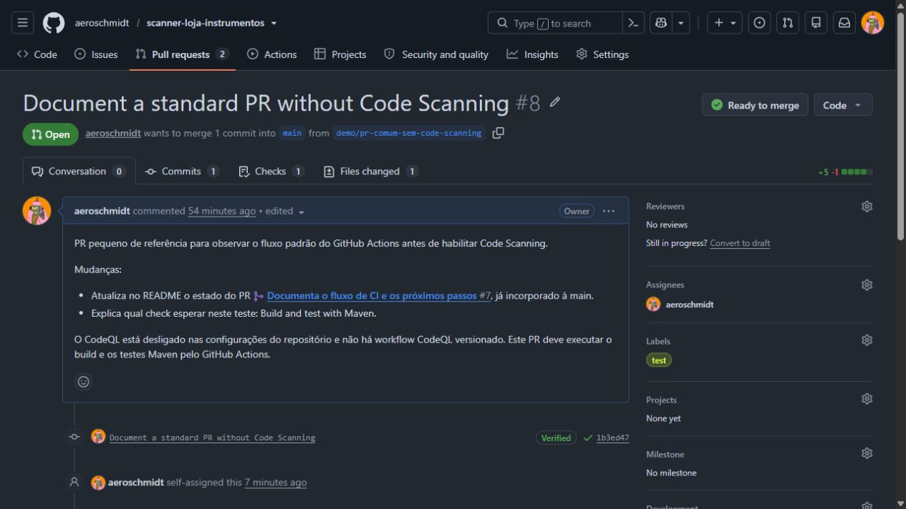

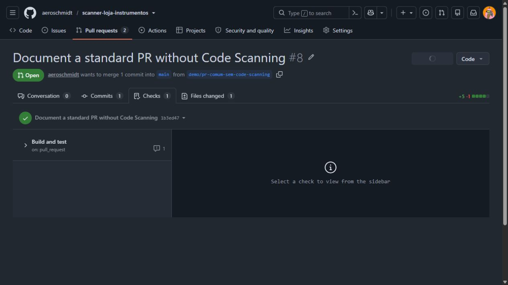

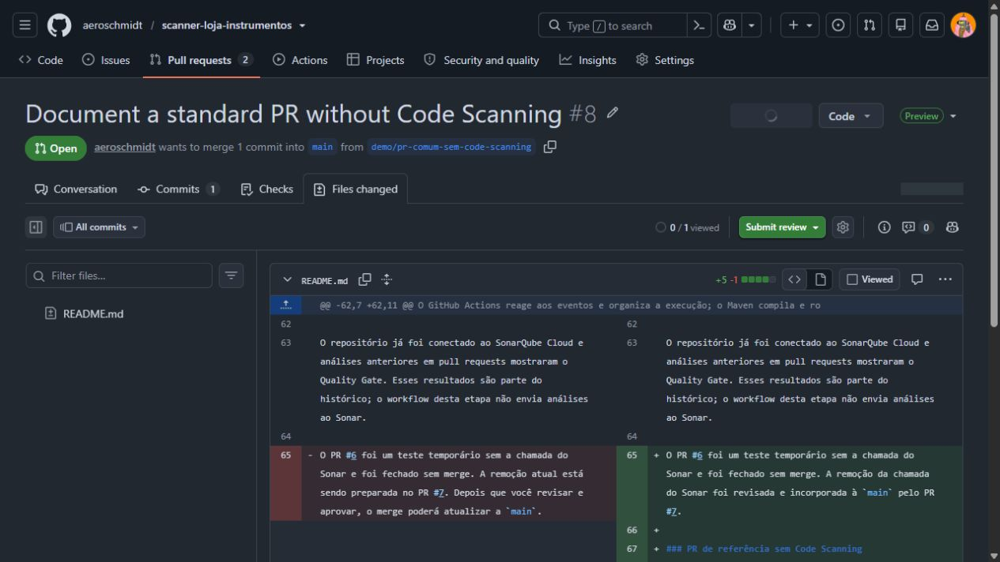

O resultado verde confirma somente que o workflow configurado passou. Nesse exemplo, não havia Code Scanning executando; portanto, não se deve concluir que o código foi analisado por segurança.

### PR atual com SQL Injection intencional

O [PR #9](https://github.com/aeroschmidt/scanner-loja-instrumentos/pull/9) é um exercício isolado para visualizar uma vulnerabilidade. **Não aprove nem faça merge deste PR:** a alteração insegura foi mantida de propósito para a demonstração. A página mostra a descrição e o estado atual do PR; a área de checks mostra execuções do workflow Maven, mas não mostra um check do CodeQL. A aba **Files changed** mostra o diff real.

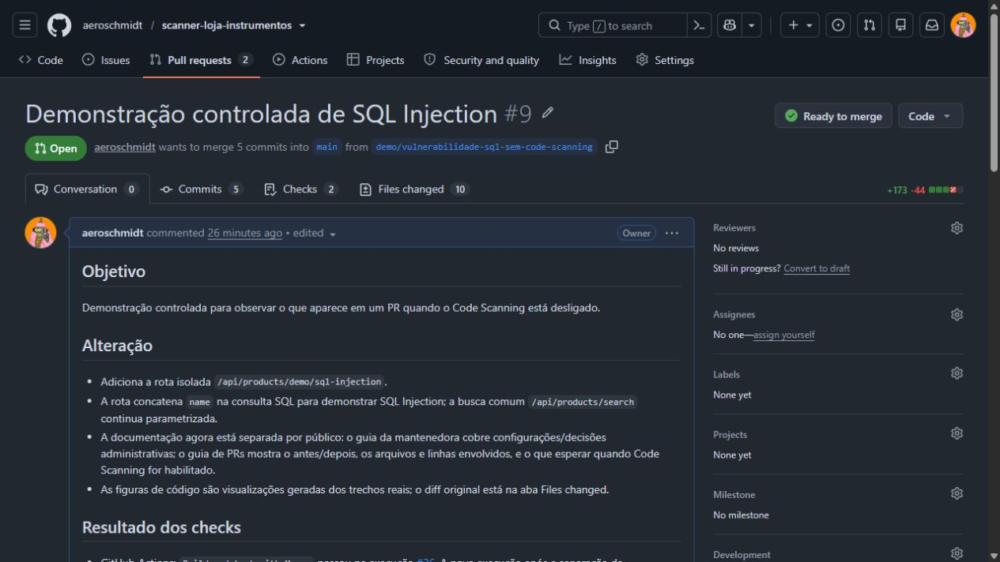

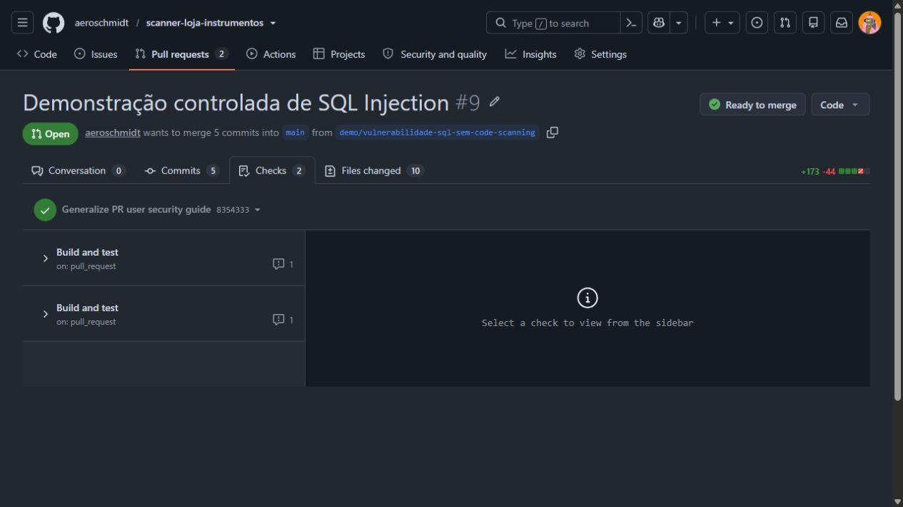

Na aplicação, a busca normal continua usando consulta parametrizada. A demonstração acrescenta uma rota separada em `ProductController.java` (`/api/products/demo/sql-injection`) que encaminha o parâmetro `name` ao método de laboratório em `ProductRepository.java`. Esse método monta a instrução SQL concatenando a entrada recebida e a envia a `jdbcTemplate.query`. A rota e a concatenação são as partes deliberadamente inseguras.

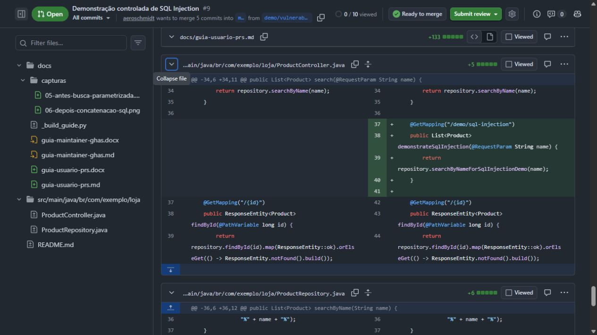

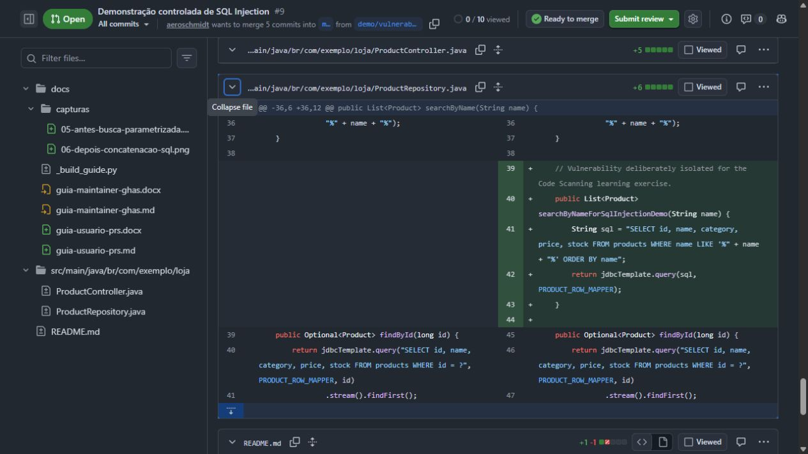

**O que funciona e o que não foi verificado neste PR:** o build Maven pode compilar a aplicação e os testes existentes podem passar mesmo com esse caminho inseguro, pois sucesso de build não é análise estática de segurança. Na execução atual do PR #9, o GitHub Actions passou; como o Code Scanning está desligado, nenhum alerta do CodeQL era esperado. O cartão “Ready to merge” também não certifica segurança: indica apenas o estado das regras e checks configurados no repositório naquele momento.

### PR #10: mesma referência segura, Code Scanning ativo

O [PR #10](https://github.com/aeroschmidt/scanner-loja-instrumentos/pull/10) foi criado a partir do commit `1b3ed47` usado como referência no PR #8. O PR #8 continua inalterado. O PR #10 acrescenta a rota de demonstração e a consulta SQL insegura ao código Java.

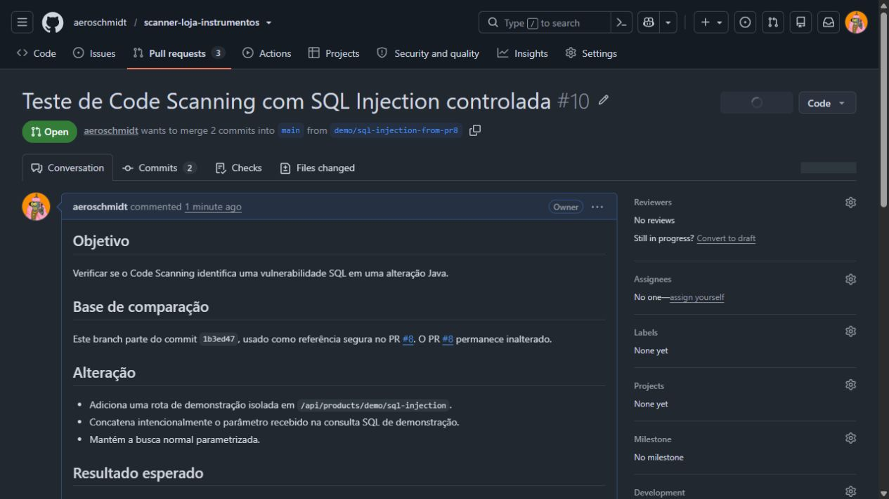

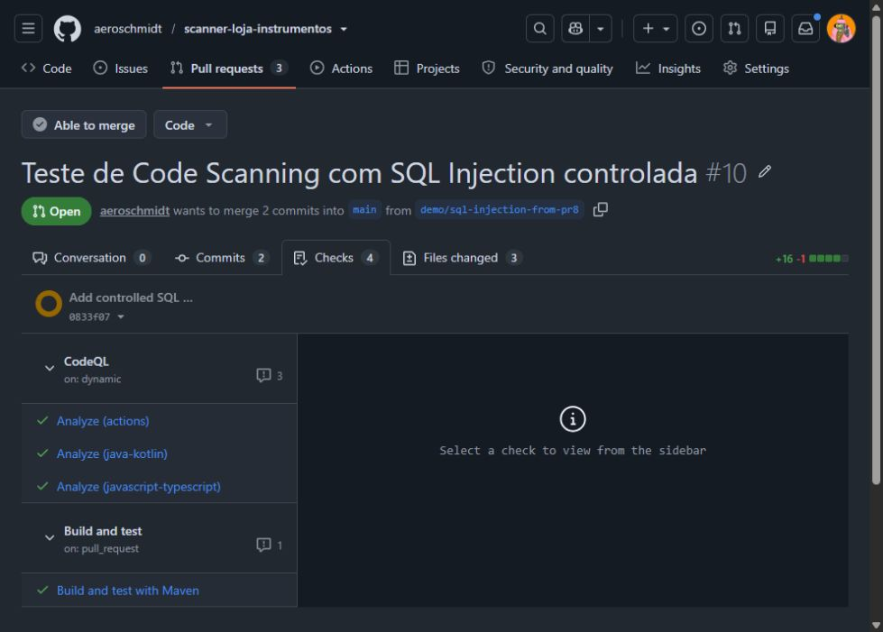

O CodeQL concluiu as análises e registrou **um alerta High**, “Query built from user-controlled sources”, em `ProductRepository.java`, linha 42. Essa é a linha que concatena `name` na instrução SQL antes de enviá-la a `jdbcTemplate.query`.

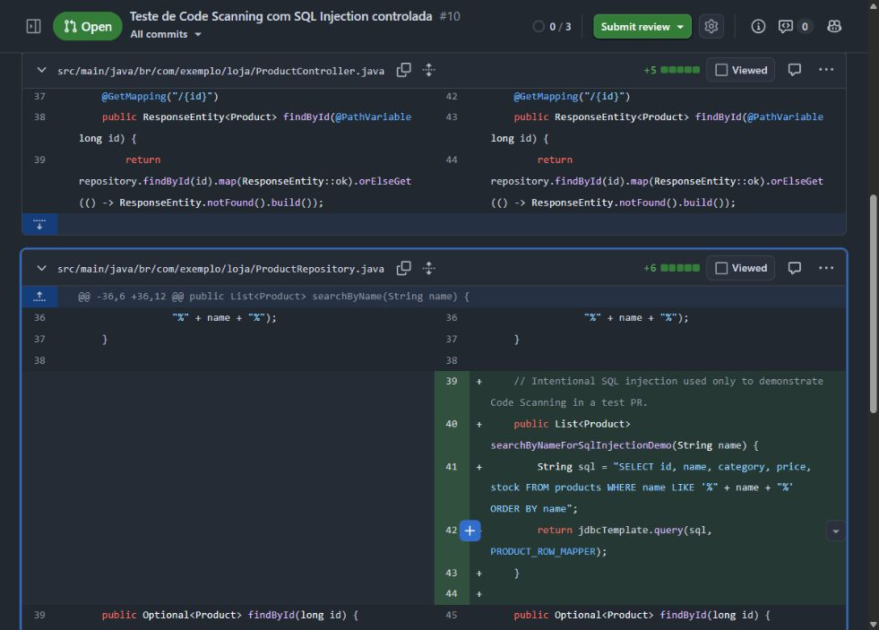

Nesta execução, os checks do CodeQL e do Maven terminaram verdes, embora o Code Scanning tenha registrado o alerta. O PR também aparece como apto a merge. Isso demonstra, neste repositório, que o alerta visível não bloqueou o merge por si só; o estado do alerta, o resultado do check e as regras de proteção são sinais separados. **Não aprove nem faça merge do PR #10:** a vulnerabilidade é intencional e o PR aguarda revisão da mantenedora.

#### Um alerta High ou Critical pode ser dispensado?

**A severidade High ou Critical, sozinha, não impede a ação “Dismiss alert”.** No GitHub, quem tem permissão de escrita no repositório pode dispensar um alerta de Code Scanning, a menos que a organização tenha ativado a aprovação delegada. Na tela atual do PR #10, o alerta é High e a opção aparece; antes de confirmar, o GitHub exige uma razão. Não selecionamos uma razão nem dispensamos o alerta.

As razões exibidas para este alerta são **False positive**, **Used in tests**, **Won't fix** e **Mitigated**. Escolha uma apenas se ela descreve de fato o caso e registre o contexto. “Dismiss” fecha/arquiva o alerta para a análise, registra a razão e o remove da contagem de alertas atuais; não altera o código e não elimina a vulnerabilidade. A documentação do GitHub informa que o descarte vale para todas as branches e que uma nova análise não reabre o mesmo alerta para o mesmo código. Por isso, uma vulnerabilidade real deve ser corrigida no código, não dispensada para fazer o aviso sumir.

No PR de laboratório, a SQL continua concatenando a entrada recebida. O alerta High deve permanecer aberto até a correção da consulta; a tela de dismiss serve para demonstrar o fluxo, não para aprovar ou aceitar o risco.

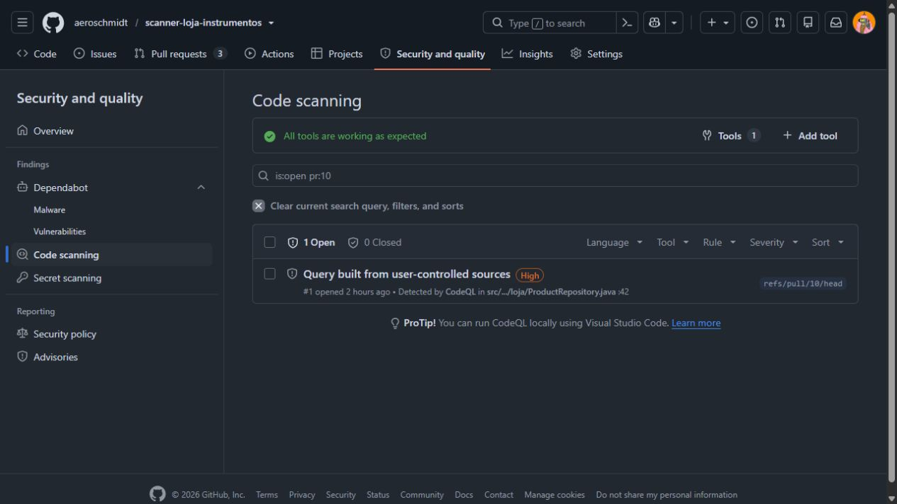

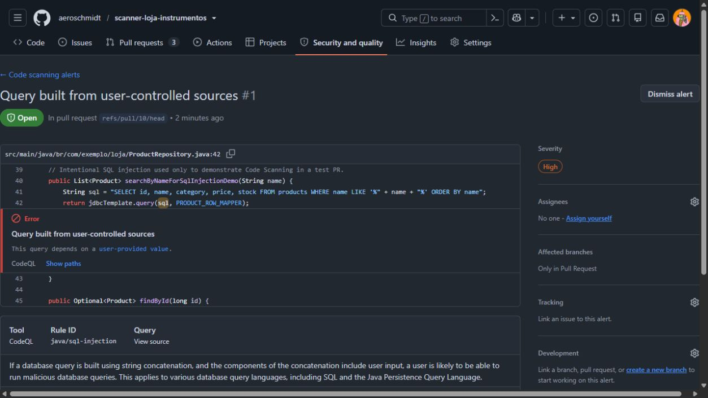

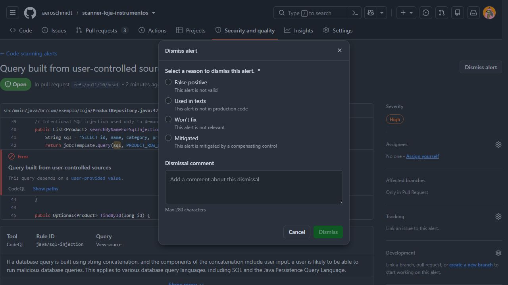

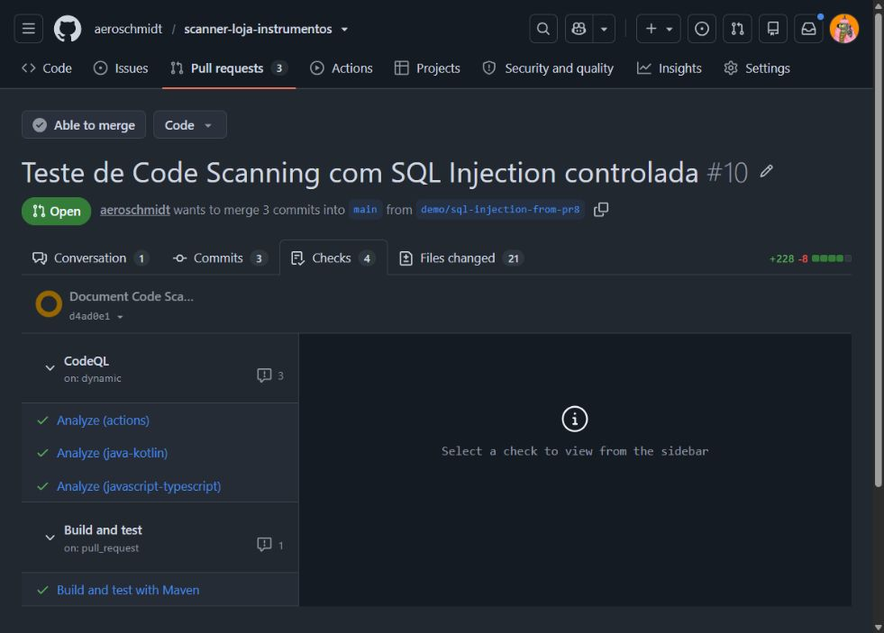

O botão de dismiss é diferente de um bloqueio de merge. Se a equipe quiser restringir quem pode dispensar alertas, a mantenedora pode habilitar **delegated alert dismissal**. Nesse modelo, pessoas com acesso de escrita solicitam o descarte; proprietários da organização e security managers analisam a solicitação. A regra e o check exigido pela branch continuam sendo configurados separadamente.

### Evidência anterior com Code Scanning ativo

Para comparar com o caso atual, o PR histórico [#7](https://github.com/aeroschmidt/scanner-loja-instrumentos/pull/7) contém a captura de uma análise do CodeQL que apontou um alerta **High** na chamada de `jdbcTemplate.query`, na linha que envia a consulta concatenada. A origem do dado não confiável aparece na montagem da SQL logo acima. A alteração foi posteriormente corrigida antes de o PR #7 ser integrado; a captura documenta a revisão histórica, não o estado atual da branch principal.

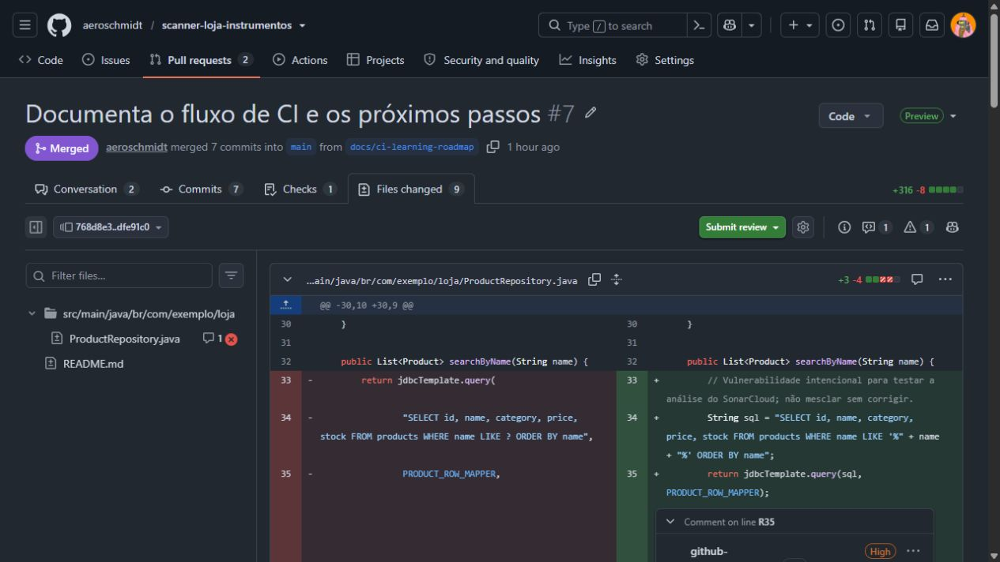

Na execução associada à versão vulnerável, o job Maven também falhou na etapa de testes. O log mostra `BUILD FAILURE` e falha do objetivo `maven-surefire-plugin:test`. Esse resultado veio dos testes da aplicação; é diferente do alerta estático do CodeQL. Uma vulnerabilidade não precisa fazer o build falhar: neste exercício, a falha Maven e o alerta CodeQL foram sinais independentes.

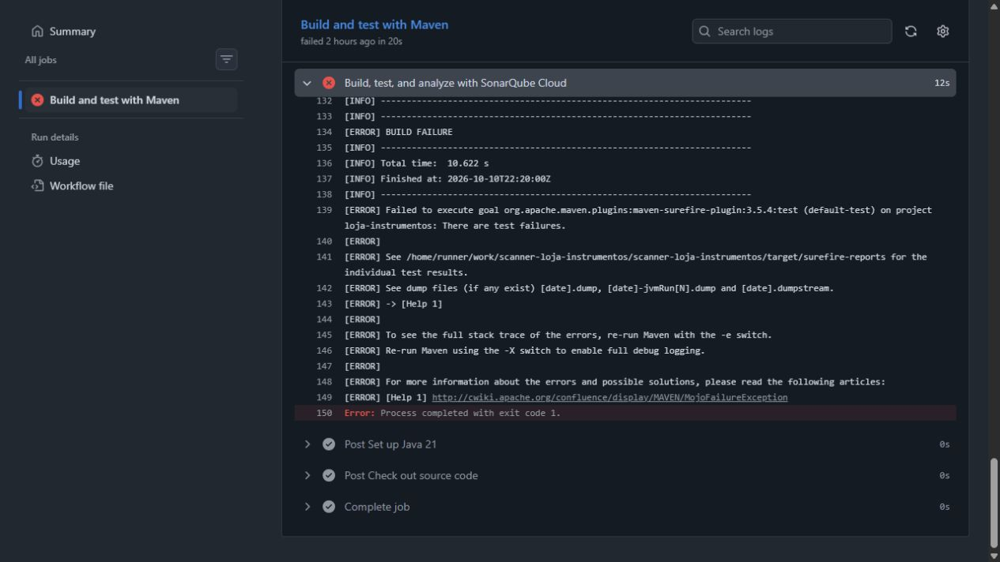

O CodeQL pode apontar arquivo, localização e regra quando a análise executada reconhece o fluxo vulnerável. Isso, por si só, não torna o alerta um bloqueio de merge. Para impedir integração, a equipe precisa configurar uma regra que exija o check apropriado; além disso, alertas e checks são estados distintos. A decisão final deve seguir a revisão e aprovação humana exigidas pelo repositório.

### Como interpretar a comparação

- **PR #8, documentação sem Code Scanning:** o workflow de build/teste ficou verde e o diff foi pequeno. Isso não mostra uma análise de segurança do código.
- **PR #9, SQL Injection com Code Scanning desligado:** o workflow ficou verde e o diff mostra o caminho inseguro; não há check do CodeQL. Isso não significa que o código está seguro nem que passou por análise estática.
- **PR #7 histórico, CodeQL ativo:** há um alerta High localizado na chamada SQL e um job Maven que falhou nos testes. Isso não significa que todo alerta falha o build ou bloqueia o merge.

Os screenshots preservam o contexto de cada tela. Ao registrar uma nova ferramenta ou alteração de configuração, capture também o estado anterior, o diff, os checks e a localização do alerta ou falha; identifique se a imagem é atual ou histórica e não exponha credenciais ou dados reais.
